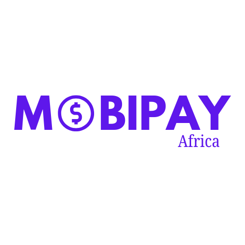

<p align="center">
  
</p>

<h1 align="center">MobiPay Africa</h1>

<p align="center">
  
  
  
  
  
  
</p>


Unified Mobile Money Payment SDK for Africa
Supports M-Pesa, MTN Mobile Money, Airtel Money, Zain, and extensible for more.

MobiPay Africa provides a consistent, simple-to-use API that abstracts the differences across African mobile money providers, allowing you to:

- Process payments
- Verify transactions
- Check balances
- Swap providers dynamically

Build gateways, backend apps, and integrations faster

## Features

- Strategy Pattern Architecture (plug-and-play providers)
- Supports multiple African mobile money operators
- Unified API interface
- Secure API requests via axios
- Written in TypeScript
- Dual support for TypeScript and CommonJS
- Easy to extend and customize

## Installation
```bash
npm install mobipay-africa
```

Or with Yarn:

```bash
yarn add mobipay-africa
```

### Directory Structure
```
src/
├── core/
│   ├── PaymentProvider.ts
│   └── PaymentContext.ts
├── providers/
│   ├── MpesaProvider.ts
│   ├── MtnProvider.ts
│   ├── AirtelProvider.ts
│   └── ZainProvider.ts
├── utils/
│   ├── httpClient.ts
│   └── logger.ts
└── index.ts
```

## Usage
1. Import and Initialize a Provider

Example: M-Pesa
```js
import { PaymentContext, MpesaProvider } from "mobipay-africa";

const mpesa = new MpesaProvider({
  apiKey: process.env.MPESA_API_KEY!,
  shortcode: "123456",
  baseUrl: "https://api.safaricom.co.ke"
});

const payment = new PaymentContext(mpesa);
```
2. Initiate a Payment
```js
await payment.initiatePayment({
  amount: 100,
  phone: "254712345678",
  reference: "ORDER12345"
});
```
3. Verify a Payment
```js
const status = await payment.verifyPayment("ORDER12345");
console.log(status.data);
```
4. Check Balance
```js
const balance = await payment.checkBalance();
console.log(balance.data);

🔌 Switching Providers (Strategy Pattern)
import { PaymentContext, MpesaProvider, MtnProvider } from "mobipay-africa";

const context = new PaymentContext(new MpesaProvider(mpesaConfig));

await context.initiatePayment({ amount: 150, phone: "254..." });

// Switch to MTN instantly
context.setProvider(new MtnProvider(mtnConfig));

await context.initiatePayment({ amount: 300, phone: "256..." });
```
### Supported Providers


|  Provider      |  Country Coverage               | Status          |
|----------------|---------------------------------|-----------------|
|   M-Pesa       | Kenya, Tanzania, DRC            | ✅ Supported    |
| MTN MoMo	     | Uganda, Rwanda, Cameroon, Ghana | 🔧 Implementing |
| Airtel Money   | East Africa, Central Africa	   | 🔧 Implementing |
| Zain / Mgurush | South Sudan & MEA	           | 🔧 Implementing |

You can easily extend the SDK:

```js
import { PaymentProvider } from "mobipay-africa";

class CustomMoneyProvider implements PaymentProvider {
  name = "custom";

  async initiatePayment(data: any) {
    // custom logic
  }

  async verifyPayment(reference: string) {
    // custom logic
  }

  async checkBalance() {
    // custom logic
  }
}
```

Then use it:

```js
const payment = new PaymentContext(new CustomMoneyProvider());

🛠 Configuration Example (M-Pesa)
const mpesa = new MpesaProvider({
  apiKey: "YOUR_API_KEY",
  shortcode: "123456",
  baseUrl: "https://sandbox.safaricom.co.ke"
});
```
### Running Tests
```bash
 npm test
```
### Build
```bash
npm run build
```

Outputs to /dist.

## Contributing

Contributions are welcome!

- Fork the repo
- Create a new branch
- Commit your changes
- Open a Pull Request

# License

MIT License
You are free to modify, distribute, and use this SDK in commercial projects.